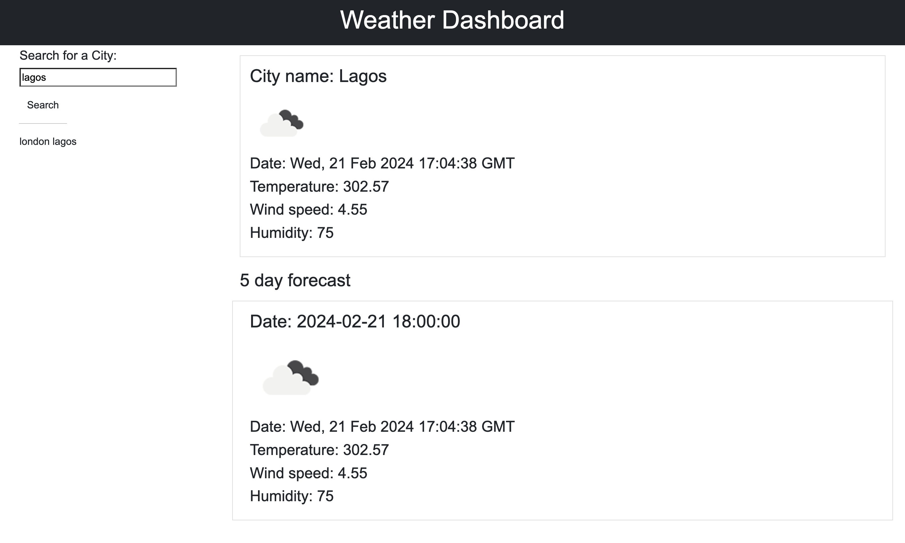

# weather-dashboard-temiakin
A weather dashboard with form inputs, which utilises OpenWeather API to retrieve weather data

## Description

This project fullfils the criteria of building a browser application that allows users to view the current and future weather (5 day) for a city that they search for (via the search field).

## Installation

N/A

## Usage

This application runs in the browser and allows its user to search for current and future weather for a chosen city.

The application displays the current date and time by utilising day.js library.

## Built with

  

Utilises OpenWeather map API: https://openweathermap.org/forecast5

## License

MIT license